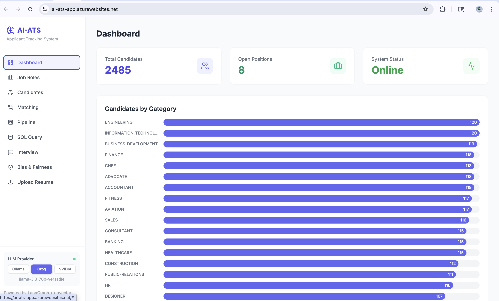
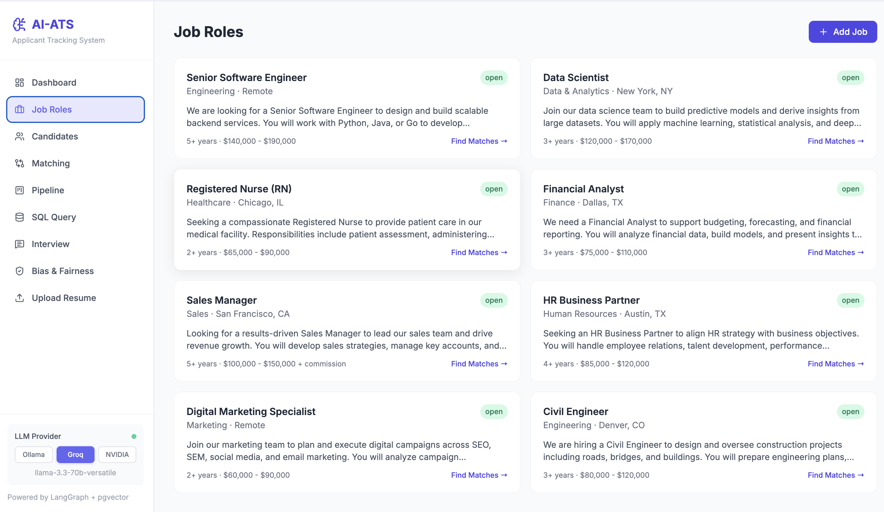
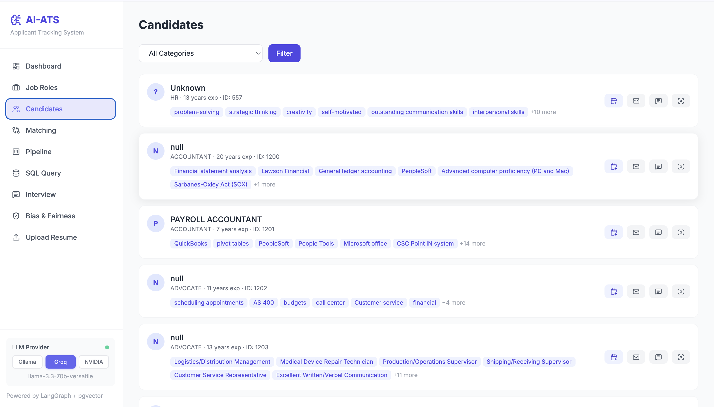
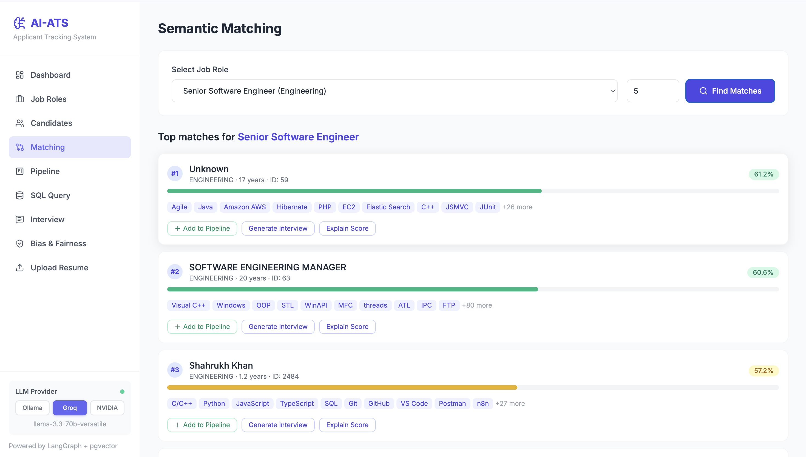
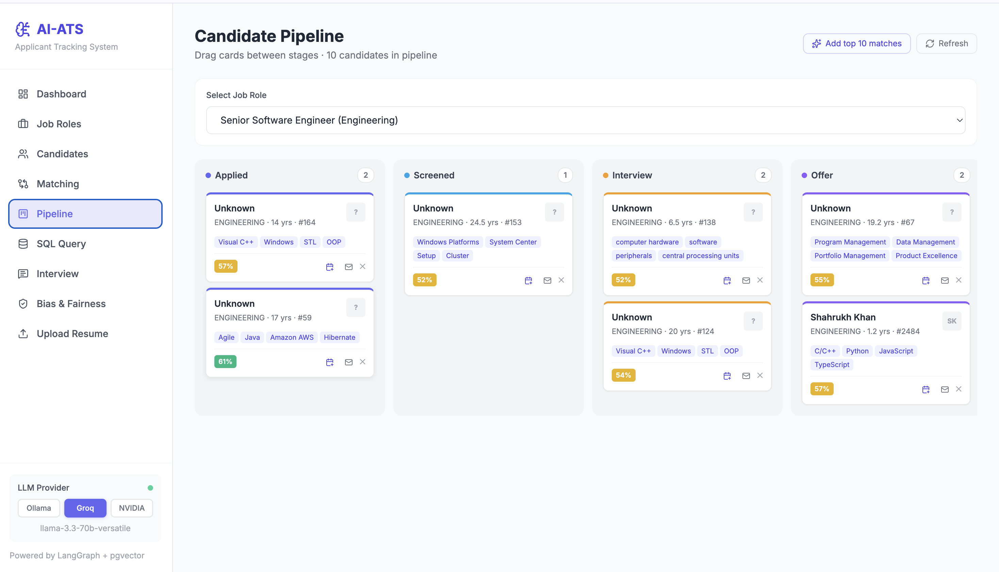
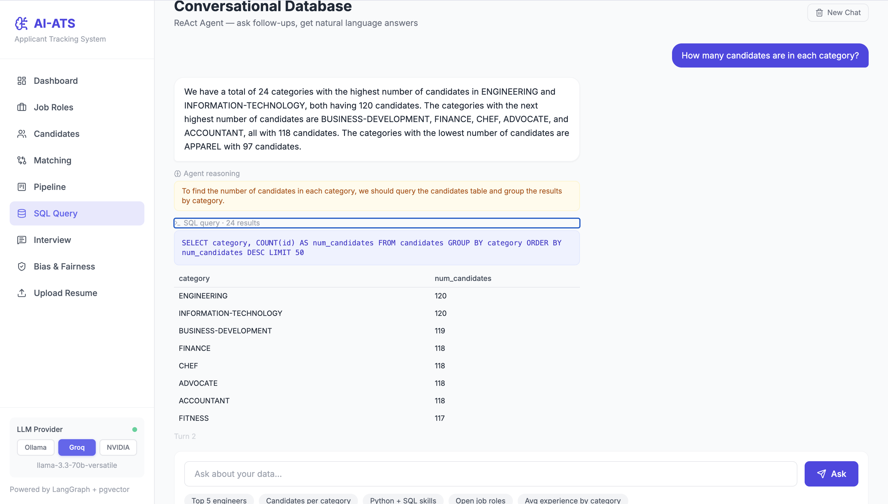
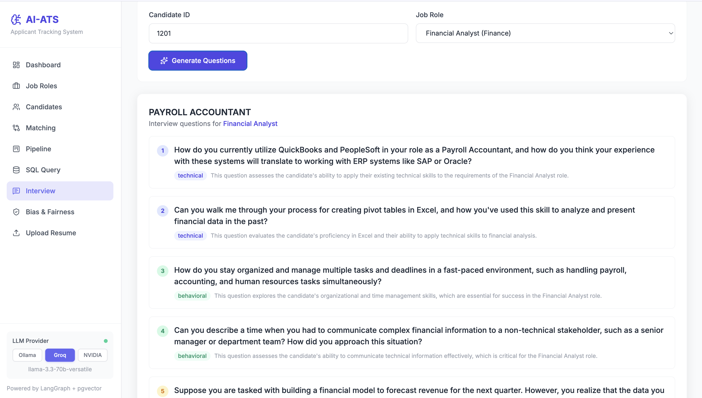
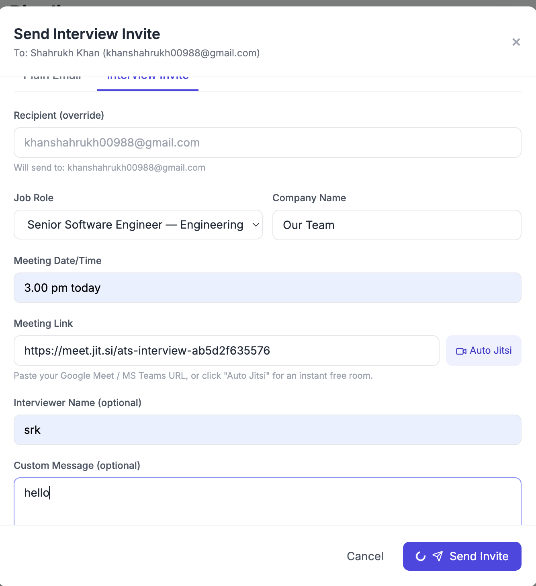

# AI Talent Discovery & Recruitment Platform

> An end-to-end AI hiring copilot — recruiters post a role, the system finds the right people, ranks them, and gets them on a call. With bias audits and explainable scoring built in.

**Live demo →** [ai-ats-app.azurewebsites.net](https://ai-ats-app.azurewebsites.net) · **Stack:** FastAPI · LangGraph · pgvector · Azure

---

## 1. The Problem

Hiring teams are drowning.

- The average corporate role gets **250+ applicants**.
- Recruiters spend **6–8 seconds** per résumé. Strong candidates get missed.
- Keyword-based ATS tools reject qualified people because they wrote "ML" instead of "machine learning."
- Outreach is manual, repetitive, and impersonal.
- "AI" tools that *do* exist are black boxes — no fairness checks, no explainability, no way for a recruiter to push back.

The result: slow time-to-hire, expensive funnels, and biased shortlists.

---

## 2. The Solution

A single platform where a recruiter can:

1. **Post a job** in 30 seconds.
2. **Match** it against an indexed pool of thousands of candidates using semantic AI — not keywords.
3. **See ranked candidates** with explanations for *why* each one scored what they did.
4. **Drag them through a Kanban pipeline** (Applied → Screened → Interview → Offer → Hired).
5. **Send branded interview invites** with auto-generated meeting links — one click.
6. **Audit every shortlist for bias** before anyone gets contacted.

It's not a résumé checker. It's the recruiter's full workflow, AI-native from day one.

---

## 3. What Makes This Different

- 🧠 **Semantic matching, not keyword matching** — pgvector + sentence-transformer embeddings catch "Python ↔ Django ↔ Flask" the way a human would.
- 💬 **Talk to your data** — a ReAct agent turns plain English ("show me top 5 engineers in Bangalore with 3+ years") into SQL, runs it, explains the answer.
- ⚖️ **Fairness built-in** — every shortlist can be audited for demographic parity (fairlearn) and every score is explainable (SHAP).
- 🔌 **Multi-LLM by design** — hot-switch between Groq (fast), NVIDIA NIM (accurate), or Ollama (offline) from the sidebar. No vendor lock-in.
- 🛡️ **7-layer guardrails** — prompt-injection scanning, PII redaction, SQL guard, résumé-shape validation, rate limiting. Production-grade, not demo-grade.

---

## 4. Demo

🌐 **Live app**: [ai-ats-app.azurewebsites.net](https://ai-ats-app.azurewebsites.net)
🎥 **Walkthrough video**: _Coming soon_
📸 **Screenshots**: see [`/assets/screens/`](assets/screens/)

---

## 5. Core Features

### 📥 Smart Résumé Intake
- **What it does**: Drop in a PDF, get back a fully structured candidate profile.
- **How**: Magic-byte validation → résumé-shape heuristic → LLM extraction (name, skills, experience, education) → 384-dim embedding → pgvector insert.
- 👉 **Impact**: Onboarding 1,000 résumés takes minutes, not days. Bad/garbage uploads are rejected before they pollute the index.

### 🎯 Semantic Candidate Matching
- **What it does**: Type a job description, get a ranked shortlist of the best candidates from your pool.
- **How**: Job description → embedding → cosine similarity over pgvector → top-K results with score breakdown.
- 👉 **Impact**: Recruiters spend their time *talking* to good candidates instead of *searching* for them.

### 💬 Conversational Database (ReAct Agent)
- **What it does**: Ask any question about your candidates in plain English.
- **How**: ReAct loop — the LLM thinks, generates SQL, runs it through a SELECT-only guard, observes results, and writes a natural-language answer. Multi-turn memory included.
- 👉 **Impact**: Anyone on the hiring team can self-serve insights without learning SQL or pinging the data team.

### 🗂️ Kanban Pipeline
- **What it does**: Visual drag-and-drop pipeline showing every candidate's stage per role.
- **How**: Per-job state stored in Postgres; drag events sync via REST. Stages: Applied → Screened → Interview → Offer → Hired / Rejected.
- 👉 **Impact**: One glance tells you exactly where every active candidate stands.

### 📧 Interview Invites with Auto-Jitsi Links
- **What it does**: One click sends a templated, branded HTML email with a working video meeting link.
- **How**: Gmail SMTP (STARTTLS) + Jitsi room generated from a UUID. Recruiters can override recipient, interviewer name, time, and add a custom message.
- 👉 **Impact**: Cuts shortlist-to-scheduled-interview from hours to seconds.

### 🧠 AI Interview Question Generator
- **What it does**: Generates technical, behavioral, and situational questions tailored to a specific candidate and role.
- **How**: Candidate résumé + JD → LLM prompt → structured JSON of questions per category.
- 👉 **Impact**: Interviewers walk into every call prepped, with questions that probe the actual gap between candidate and role.

### ⚖️ Bias & Fairness Audit
- **What it does**: Audits any shortlist for demographic parity and explains individual scores.
- **How**: Fairlearn for group fairness metrics, SHAP for per-feature score attribution, automatic PII anonymization before scoring.
- 👉 **Impact**: Catch biased models *before* candidates are contacted. Provide auditable hiring decisions.

### 🔌 Multi-LLM Provider Switch
- **What it does**: Toggle between Groq, NVIDIA NIM, and local Ollama from the sidebar.
- **How**: A unified `llm_chat()` / `llm_chat_json()` router with provider-specific clients behind it. Switch is hot — no restart needed.
- 👉 **Impact**: Optimize cost vs. latency vs. privacy per workload. Run fully offline if needed.

---

## 6. Architecture

```
┌─────────────────────────────────────────────────────────────────┐
│  Browser SPA  (Tailwind + vanilla JS)                           │
└────────────────────────┬────────────────────────────────────────┘
                         │ HTTPS
                         ▼
┌─────────────────────────────────────────────────────────────────┐
│  Azure App Service · FastAPI + Uvicorn                          │
│  ────────────────────────────────────────────────────────────   │
│  CORS  →  Rate Limit  →  Route  →  Guardrails (7 layers)        │
└─────┬─────────┬──────────┬──────────┬──────────┬────────────────┘
      │         │          │          │          │
      ▼         ▼          ▼          ▼          ▼
   Parser    RAG       Agents      Bias     Communication
   (PDF →   (semantic  (LangGraph  (fairlearn  (SMTP +
    LLM →    matching) orchestrator+ + SHAP)    Jitsi)
    JSON)              ReAct SQL)
      │         │          │          │
      └─────────┼──────────┴──────────┘
                ▼
   ┌─────────────────────────────────────┐
   │  PostgreSQL 16 + pgvector           │
   │  (candidates, jobs, pipeline,       │
   │   embeddings — 384-dim cosine)      │
   └─────────────────────────────────────┘

   External:  Groq · NVIDIA NIM · Ollama · Gmail SMTP
```

**Résumé upload**: `PDF → magic bytes → résumé heuristic → LLM parse → embed → guard → insert`

**Matching**: `JD text → embed → pgvector cosine → top-K → score explainability → render`

---

## 7. Tech Stack

**Backend**
- Python 3.11 · FastAPI · Uvicorn · Pydantic v2
- LangGraph (StateGraph orchestrator) · LangChain
- SQLAlchemy · psycopg2

**Frontend**
- Jinja2 templates · Tailwind CSS · Lucide icons
- Plus Jakarta Sans + Instrument Serif (italic accents) + Geist Mono
- Vanilla JS (no framework — fast first paint)

**AI / NLP**
- Groq (`llama-3.3-70b-versatile`)
- NVIDIA NIM (`llama-3.3-70b-instruct`)
- Ollama (`gemma3:12b` — local fallback)
- sentence-transformers (`all-MiniLM-L6-v2`, 384-dim)
- fairlearn · SHAP · scikit-learn

**Database**
- PostgreSQL 16
- pgvector extension (cosine similarity, IVFFlat index)

**Infrastructure**
- Docker (multi-arch buildx, `linux/amd64`)
- Azure Container Registry
- Azure App Service (Linux container)
- Azure Database for PostgreSQL Flexible Server
- ACR webhook → App Service auto-roll

---

## 8. Setup (Local with Docker)

```bash
# 1. Clone
git clone https://github.com/shahrukh120/capstone.git
cd capstone

# 2. Configure environment
cp .env.example .env
# Edit .env — at minimum one LLM key:
#   GROQ_API_KEY=...        (recommended — fast + free tier)
#   NVIDIA_API_KEY=...      (alternative)
# Optional for email invites:
#   SMTP_HOST=smtp.gmail.com
#   SMTP_USER=you@gmail.com
#   SMTP_PASSWORD=your-gmail-app-password

# 3. Boot the stack
docker compose up --build

# 4. Open the app
open http://localhost:8000
```

**Seed sample data** (optional — ~2,500 sample candidates):
```bash
docker compose exec app python scripts/seed_candidates.py
```

**Run without Docker** (requires Postgres 16 + pgvector locally):
```bash
python -m venv venv && source venv/bin/activate
pip install -r requirements.txt
uvicorn src.api.main:app --reload
```

---

## 9. Screenshots

| | |
|---|---|
|  |  |
|  |  |
|  |  |
|  |  |

---

## 10. Roadmap

- 🎙️ **AI Voice Interviewer** — 15-min screening calls in the browser via OpenAI Realtime API + LiveKit, with adaptive follow-ups and post-call rubric scoring.
- 📅 **Calendar sync** — Google Calendar / Outlook two-way sync for interview slots.
- 🔗 **ATS integrations** — Greenhouse, Lever, Workday connectors.
- 🏢 **Multi-tenant + SSO** — workspace isolation, SAML / OIDC.
- 📊 **Compliance exports** — EEOC and DPDP-ready audit reports.
- 📱 **Mobile recruiter app** — review and message candidates on the go.

---

## 11. Technical Details

<details>
<summary><b>Orchestrator (LangGraph)</b></summary>

The pipeline is a `StateGraph` with three nodes — `parser_node`, `matching_node`, `interview_node` — sharing a typed `PipelineState`. Each node calls `llm_chat()` or `llm_chat_json()` through the provider router, allowing the same graph to run on Groq, NVIDIA, or Ollama with no code changes. State transitions are strictly typed; failures bubble up with structured errors.
</details>

<details>
<summary><b>RAG / pgvector</b></summary>

Résumés and job descriptions are encoded with `all-MiniLM-L6-v2` (384 dimensions). Candidate embeddings live in a `vector(384)` column on Postgres with an IVFFlat index (cosine ops). Match queries use `1 - (embedding <=> $1)` for cosine similarity and return ranked top-K with raw distance for downstream explainability.
</details>

<details>
<summary><b>ReAct Text-to-SQL Agent</b></summary>

The agent loops through `THOUGHT → ACTION (SQL) → OBSERVATION (rows) → ANSWER`. The SQL guard rejects anything that isn't a single `SELECT`, blocks references to `pg_*` / `information_schema`, and caps result rows. Multi-turn memory is preserved per session so follow-ups ("now filter to remote") work naturally.
</details>

<details>
<summary><b>Guardrails (7 layers)</b></summary>

**Input-side**: file extension + size, PDF magic bytes (`%PDF-`), résumé-shape heuristic scorer, per-IP rate limiter.
**LLM-side**: prompt-injection scanner, JSON output validator with auto-retry, SQL guard.
**Output-side**: PII redaction in logs, NUL-byte stripping, bias anonymizer, fairness audit.
</details>

<details>
<summary><b>Bias auditing</b></summary>

For any job + threshold, the system computes demographic-parity difference and equal-opportunity difference across protected groups using fairlearn. Per-candidate SHAP values explain which features (skills, experience, education) drove the score. PII (name, address, phone) is anonymized before any model sees the data.
</details>

<details>
<summary><b>Deployment</b></summary>

`docker buildx --platform linux/amd64` builds on Apple Silicon dev machines; the resulting image is pushed to Azure Container Registry. App Service polls the ACR webhook and rolls the container with zero-downtime swap. Rollback is a one-line tag swap (`az webapp config container set ...:prior-tag`).
</details>

---

**Built by [Shahrukh Khan](https://github.com/shahrukh120)** · Capstone 2026 · Open to recruiter conversations 👋
